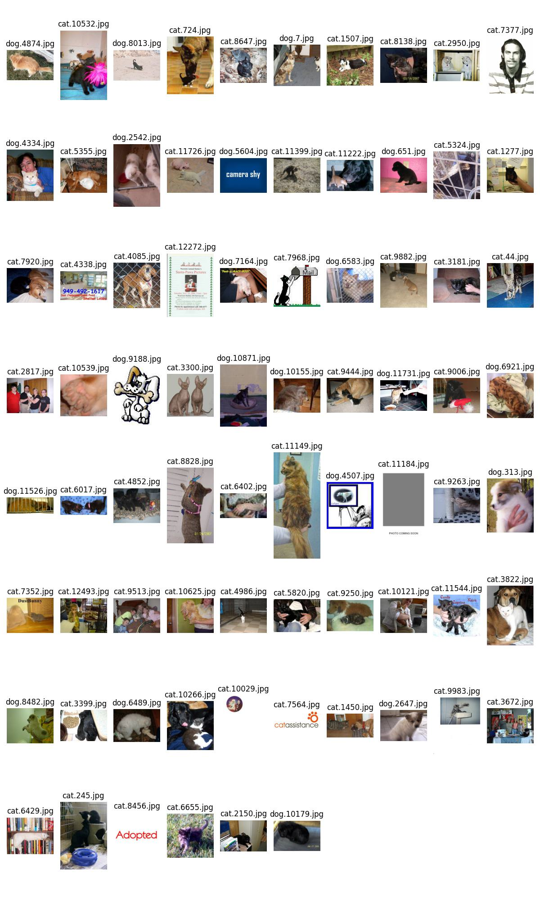

# Fail Cases Study <!-- omit in toc -->

- [Fail Cases](#fail-cases)
- [Conclusion](#conclusion)

## Fail Cases

use `swin_b` in [different models comparisons](performance.md#different-models).

- training set (N=20000)
  
  

- val set (N=1250)
  
  

- test set (N=1250)
  
  

## Conclusion

After observation, there are some major types of fail cases:

- Not dogs and cats
- Ambiguous label, there are dogs and cats shown in the same image
- Cartoon style
- Low resolution or object was too small
